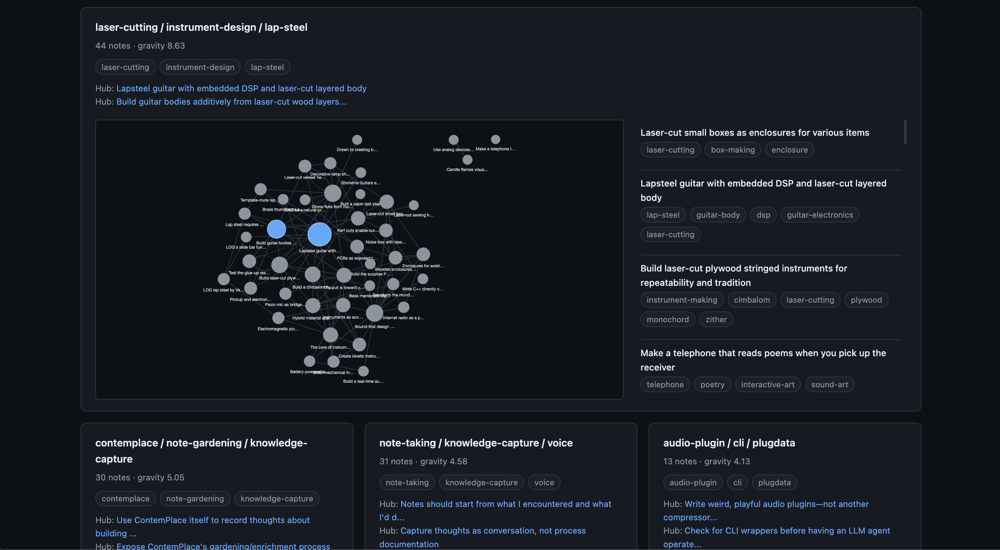

<h1 align="center">ContemPlace</h1>

<strong>Your memory, your database, any agent.</strong>

A commonplace book that auto-gardens into an MCP-connected knowledge base. Capture idea fragments from any interface — the system structures, embeds, and links them into a searchable graph in Postgres you own.

Here's a fresh Claude.ai session — no context pasted, no re-explaining. The agent queries your knowledge base via MCP:

 
<em>One prompt, and the agent pulls a cluster of linked notes it's never seen before.</em>

---

Every AI conversation starts from zero. You re-explain your project, paste context from your notes, rebuild understanding that vanishes when the session ends or you switch tools. Your thinking is scattered across platforms that don't talk to each other.

ContemPlace fixes this. Any MCP-capable agent — Claude, ChatGPT, Cursor, custom scripts — can read and write your knowledge base directly. For capture on the go, there's a Telegram bot, and the architecture makes adding more channels (Slack, WhatsApp, anything HTTPS) straightforward. A gardening pipeline runs nightly to surface connections you didn't make explicitly.

Postgres you can always query and export. The whole stack runs on free tiers. LLM costs average $2–3/month.

## How it works

1. You send a thought — raw text, voice transcription, a photo with a caption, whatever — in any language
2. The [capture agent](docs/capture-agent.md) translates to English if needed, titles it, corrects voice errors, tags it, and links it to related notes — your exact words are always preserved in the original language
3. A nightly gardener finds connections you didn't make explicitly and detects thematic clusters across your fragments
4. Any MCP-capable agent can search, browse, and build on your accumulated knowledge

 
<em>Telegram capture: voice input from your phone → structured fragment with title, tags, corrections, and links to existing notes.</em>

## Visual dashboard

 
<em>The laser-cutting / instrument-design cluster expanded — hub notes in blue, gardener-detected links dashed, 44 interconnected fragments.</em>

A dark-themed web dashboard lets you see what agents can only describe. Three panels, no framework, loads instantly:

- **Stats bar** — total notes, links, clusters, capture rate, and five health indicators (gardener freshness, orphan ratio, cluster coverage, link density, backup recency) with green/amber/red dots
- **Cluster grid** — thematic clusters ordered by gravitational weight, with a resolution slider to zoom between coarse and fine-grained views. Click any cluster to expand a force-directed graph showing how its notes connect — hub notes highlighted, capture-time links solid, gardener links dashed
- **Recent captures** — the last 15 fragments with source badges, tags, and image thumbnails for visual notes

The dashboard is the only place you can see image-bearing notes — MCP clients can't render images inline, but the dashboard loads them directly from R2. Hosted on Cloudflare Pages, authenticated with a single API key per device.

## MCP tools

The MCP server is the primary interface, usable by any MCP-capable agent:

| Tool | What it does |
|---|---|
| `search_notes` | Search notes by meaning. Ranked results with body text. Optional tag filter. |
| `get_note` | Fetch a single note — body, raw_input (source of truth), links, corrections. Image-bearing notes include an inline image for model vision. |
| `list_recent` | Most recent notes, newest first. |
| `get_related` | All linked notes in both directions with link types and confidence. |
| `list_clusters` | See the shape of your thinking. Thematic clusters detected by the gardener — resolution controls zoom level, hub notes surface conceptual anchors. |
| `capture_note` | Pass raw words — the server runs the full capture pipeline. Do not pre-structure. |
| `remove_note` | Remove a note. Recent notes (< grace window) are permanently deleted; older notes are soft-archived and recoverable. |
| `trigger_gardening` | Trigger the gardening pipeline on demand — recomputes similarity links, clusters, and entities. 5-minute cooldown. |

**Auth:** OAuth 2.1 (Authorization Code + PKCE) for browser clients like Claude.ai, or a static Bearer token for CLI/SDK callers like Claude Code. Both paths are permanent.

## Stack

| Layer | Technology |
|---|---|
| Compute | Cloudflare Workers (TypeScript) |
| Database | Supabase (Postgres 16 + pgvector) |
| AI gateway | OpenRouter (OpenAI-compatible SDK) |
| Embeddings | `openai/text-embedding-3-small` (1536 dimensions) |
| Capture LLM | `anthropic/claude-haiku-4-5` |
| Object storage | Cloudflare R2 (photo attachments from Telegram) |
| Capture interface | Telegram bot (webhook-based) |
| Agent interface | MCP server (JSON-RPC 2.0 over HTTP) |

Every model is an environment variable. All AI calls route through OpenRouter — if you prefer a different model, change one config value. No code changes, no vendor lock-in at the model layer either.

## Trust and control

**Your words stay yours.** The capture agent structures your input — title, tags, links — but never compresses, interprets, or adds meaning you didn't express. Your exact words are always preserved alongside the structured version. Today's LLM interprets them one way; tomorrow's can reinterpret the same raw input with better understanding. Nothing is lost. [How the trust contract works →](docs/philosophy.md#3-the-trust-contract)

**You decide what goes in.** No background scraping, no automatic capture. You send what you want captured, and you're the quality gate. The system trusts your judgment — guard rails and warnings are fine, but your editorial control is what keeps the knowledge base honest. [The curator principle →](docs/philosophy.md#7-low-friction-aware-curator)

**No lock-in.** Postgres you can query and export any time. MCP means any compatible agent works — Claude, ChatGPT, Cursor, custom scripts. Switch tools whenever you want. The database doesn't care who's reading it. [Data ownership →](docs/philosophy.md#12-your-data-any-agent)

**Daily backups on the free tier.** A GitHub Actions workflow runs every night, dumping your entire database — notes, embeddings, links, RPC functions — to a private repo you control. Three SQL files, full git history as retention, zero cost. If something goes wrong, you restore with `psql` and your data is back. The workflow ships with the repo; you enable it by setting two secrets. [Setup →](docs/setup.md#8-configure-automated-backups-optional)

The [full design philosophy](docs/philosophy.md) lays out the design principles with the reasoning behind each — not marketing copy, but the actual constraints the system is built against.

## Get started

The full stack — MCP server, database, gardening pipeline — deploys in about 10 minutes, all on free tiers. Add a Telegram bot for mobile capture if you want it.

**[Setup guide →](docs/setup.md)**

## FAQ

### What kind of notes does this store?

Idea fragments — whatever is on your mind. Observations, reflections, questions, quotes, project ideas, workflow notes. You never pick a category. Send raw text; the capture agent handles structuring. Patterns emerge from accumulation, not from you organizing anything. [More on the capture agent →](docs/capture-agent.md)

### What agents work with this?

Any MCP-capable client. Tested with Claude.ai (via OAuth) and Claude Code CLI (via static token). ChatGPT and Cursor connectors should work but are [not yet verified](https://github.com/freegyes/project-ContemPlace/issues/102). The MCP server speaks JSON-RPC over HTTP, so `curl` or any HTTP client works too.

### Does value actually scale?

Each new fragment creates edges in the graph. The nightly gardener finds similarity links you didn't ask for and detects thematic clusters — groups of fragments that share a thread. After a few hundred fragments, ask any agent "what have I been thinking about X?" and the graph does the work. You never organized anything manually — the structure emerged from accumulation.

### What happens if I stop using it?

Your data stays in Postgres. Export it, query it, migrate it. Every fragment's raw input is preserved, so you can re-process everything with different tools or models. There's no proprietary format to decode.

### Should I import my existing notes first?

You can start capturing fresh and let value build from zero — the system is designed for that. But if you have material worth bringing in, there's no automated import script. Every fragment runs through the full capture pipeline (LLM structuring, embedding, linking), so bulk import isn't a button you press.

What works is assisted re-capture: you sit with an agent, describe a topic from your existing notes, and work through the fragments together — re-voicing them in your natural capture style, reviewing each one before it enters the system. The repo includes [an example of this workflow](docs/usage.md#bringing-in-existing-notes) built for Obsidian vaults with semantic search. It's a recipe that requires your editorial judgment at every step, not a migration tool.

### What does it cost?

All infrastructure runs on free tiers (Cloudflare Workers, Supabase). The only cost is LLM calls through OpenRouter — typically $2–3/month for active daily use.

---

## Documentation

| Document | What it's for |
|---|---|
| **[Usage guide](docs/usage.md)** | What a week looks like — capturing, retrieving, curating, and what happens overnight |
| **[Philosophy](docs/philosophy.md)** | Design principles and why each exists — the constraints the system is built against |
| **[Setup guide](docs/setup.md)** | Everything to go from zero to a running instance — prerequisites, secrets, database, Workers |
| **[Architecture](docs/architecture.md)** | How the system works internally — Workers, data flow, embedding strategy, error handling |
| **[Schema](docs/schema.md)** | The database contract — tables, RPC functions, indexes, columns |
| **[Capture agent](docs/capture-agent.md)** | Capture pipeline behavior — field descriptions, linking logic, voice correction, traceability rules |
| **[Development](docs/development.md)** | Test commands, project layout, file-by-file breakdown — contributor reference |
| **[Decisions](docs/decisions.md)** | Architecture Decision Records — timestamped, immutable, one per significant choice |
| **[Roadmap](docs/roadmap.md)** | What each phase delivered and what's next |

*This README is the front door — it answers "what is this?" and "should I try it?" in under a minute. Everything deeper lives in the docs above.*
