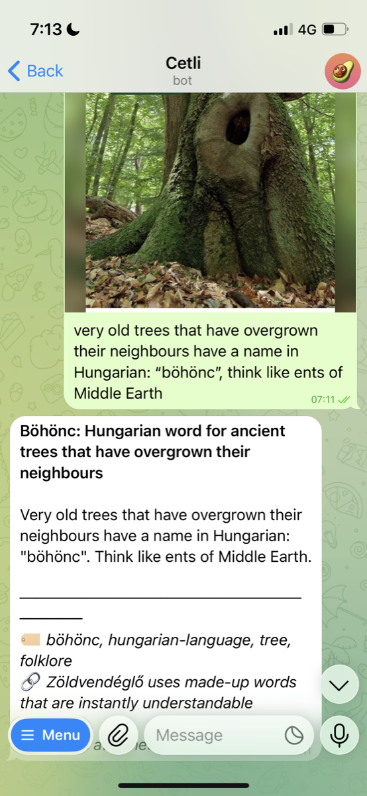
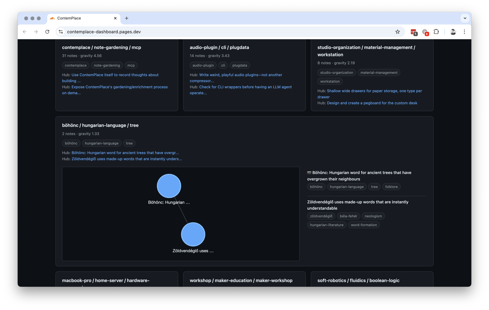
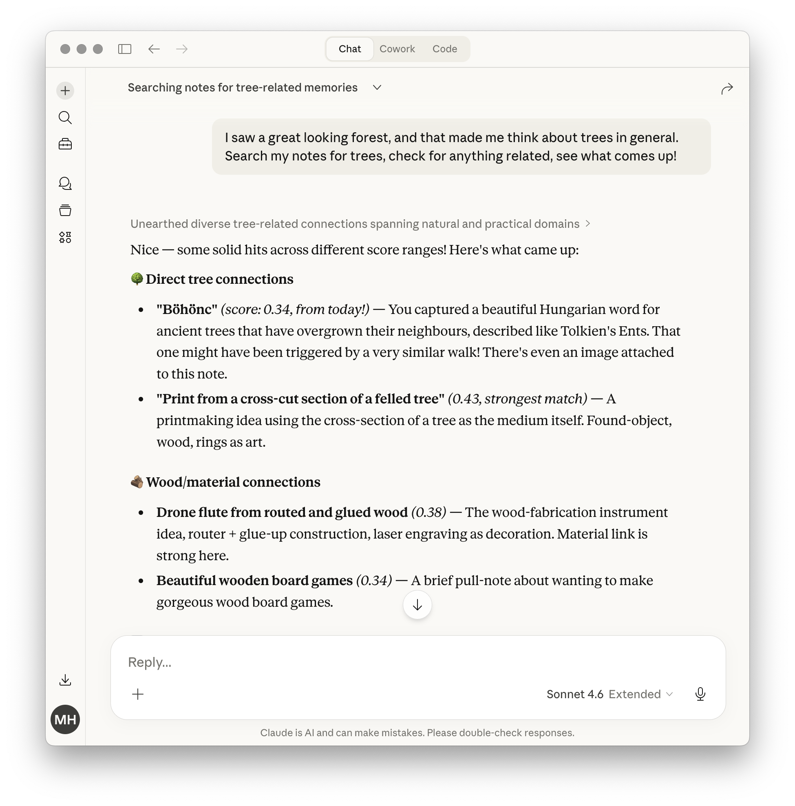

# Using ContemPlace

*You have it running. Here's what it actually feels like — told through one real example, from a photo of a tree to a walk in the forest.*

---

## A real example: from capture to action

You're browsing the internet and you spot the word "böhönc." Hungarian for ancient trees that have overgrown their neighbors — think Tolkien's Ents. You love that. You take a screenshot, open Telegram, and send the photo with a one-line note:

> very old trees that have overgrown their neighbours have a name in Hungarian: "böhönc", think like ents of Middle Earth

A few seconds later, the bot replies.

<div align="center">

<br />
<em>Photo stored in R2, note structured with title and tags, linked to a related note — raw input preserved exactly as sent.</em>
</div>

The title is a claim extracted from your words: **Böhönc: Hungarian word for ancient trees that have overgrown their neighbours.** Four tags. And a link — the system found a related note about a book that uses unusual, evocative words. You didn't ask for the connection. The system embedded your raw text, searched for similar notes, and let the LLM decide a link existed.

You close Telegram and don't think about it again.

Behind the scenes, the Worker downloaded the photo from Telegram's servers and stored it in R2. It embedded your raw text to find related notes, sent the input plus related context to the capture LLM, then re-embedded the structured English body for storage. Your photo and your exact words are preserved alongside the structured version. The structured note is for retrieval. Your words are the source of truth.

This is the capture loop. It takes a few seconds. You decide what's worth capturing — you're the curator, the quality gate. What you don't have to think about is organization. You fire up your chat app, drop a screenshot and a few words you can relate to, and your job is done. The system handles the rest.

---

## What you can capture

The böhönc example was a photo with a caption. But capture works the same way for anything you send.

**Plain text.** A thought after a meeting. A quote from something you read. A question you can't answer yet. A half-formed observation from a walk. It doesn't need to be polished. It doesn't need to be complete.

**Voice dictation.** Speak into Telegram, and the bot gets the transcribed text. Dictation garbles words — the capture agent corrects them silently and reports what it fixed. You'll see something like *corrections: cattle stitch → kettle stitch* in the reply. The corrected version goes into the structured note. Your original words, errors and all, stay preserved in `raw_input`. The agent cross-references proper nouns against your existing notes, so if you've captured notes about bookbinding before, it knows "cattle stitch" is probably "kettle stitch."

**Photos.** Attach an image with a caption. The photo is stored in Cloudflare R2 and linked to the note. The dashboard is where you browse image-bearing notes directly — no agent needed, just you and your clusters and links. When an agent retrieves a note via `get_note`, it gets an inline base64 version for model vision, so it can see your photo and reason about it too.

**Any language.** The böhönc note was in English, but it could have been in Hungarian, Japanese, or anything else. The capture agent translates to English for the structured output — title, body, tags — while preserving meaning, tone, and specificity. The translation is logged in the corrections field (e.g., `"hu → en"`). Your original words stay untouched in `raw_input`, in whatever language you used. Embeddings use the English body, keeping the entire retrieval space monolingual. Search queries are in English.

Every capture tracks where it came from — Telegram, an MCP agent, a custom script. The dashboard shows source badges on each fragment, so you can see at a glance how your captures arrive.

### What makes a good fragment

Anything. A focused thought — one claim, a sentence or three — produces the cleanest result. But the system handles messy input too. A brain dump with three ideas. A stream-of-consciousness paragraph. A single word that means something to you. The capture pipeline structures whatever you send.

Focused fragments produce better immediate linking. Loose fragments accumulate and connect later through the gardener. Both are valuable. You don't need to decide which kind you're sending — just send.

### Links at capture time

If your fragment connects to something already in the database, the capture agent links it. The böhönc note linked to that book about unusual words without being asked. You'll see these connections in the reply:

*related: Zöldvendéglő uses made-up words that are instantly understandable*

Two link types at capture time: `related` for any meaningful connection, `contradicts` for tension or disagreement with a prior note. The system embedded your input, found the top 5 semantically similar notes, and let the LLM decide which deserve a link and what kind. You never manage this.

---

## What happens overnight

You captured the böhönc note and forgot about it. That night at 2am UTC, the gardener wakes up.

It does three things.

**Similarity links.** It compares every note against every other note by embedding similarity. When two fragments are close enough in meaning — even if they share no tags and were never linked by the capture agent — the gardener creates an `is-similar-to` link between them with a confidence score. Notes that the capture agent couldn't link — because they didn't exist yet, or because a dense topic had more than 5 candidates and the pair didn't make the cut — are now discoverable through the gardener's similarity web.

**Cluster detection.** Using the same similarity data, the gardener groups fragments into thematic clusters via Louvain community detection — at multiple resolutions, so you can see broad themes and fine-grained sub-topics. Each cluster gets a label from its most common tags and a gravity score that surfaces recent, active clusters.

Your böhönc fragment ends up clustered with the note about unusual words from that book. You didn't organize this. You didn't tag them the same way on purpose. The semantic proximity was enough. And the cluster reveals something you hadn't consciously connected: you didn't just like the tree — you liked the *word*. The thread running through your fragments is your attraction to rare, evocative vocabulary.

<div align="center">

<br />
<em>The cluster grid on the dashboard — böhönc and a note about unusual words connected in a force-directed graph, surrounded by other thematic clusters.</em>
</div>

**Entity extraction.** If enabled, the gardener identifies proper nouns (people, places, tools, projects) across new notes and maintains a corpus-wide entity dictionary. This enriches the structured data agents see when retrieving notes.

You don't see any of this happen. The next time you or an agent explores your knowledge base, the graph is richer than what you explicitly connected. The clusters reveal the shape of your thinking.

### On-demand gardening

You don't have to wait for the nightly cron. After a burst of captures — a dense brainstorming session, a batch import — call `trigger_gardening` from any MCP-connected agent. The full pipeline runs synchronously (~30 seconds) and returns the results: how many similarity links were created, how many clusters formed, how many entities were extracted. Then immediately call `list_clusters` or `get_related` to see the updated graph.

There's a 5-minute cooldown between triggers to prevent accidental spam. If you trigger too soon, the tool tells you how long to wait.

---

## Exploration: where the value compounds

Days after capturing the böhönc note, you're in a Claude session and you've just seen a beautiful forest. On impulse, you type: "I saw a great looking forest, and that made me think about trees in general. Search my notes for trees, check for anything related, see what comes up!"

<div align="center">

<br />
<em>One prompt — the agent queries your knowledge base and groups results by conceptual thread. No context pasted, no re-explaining.</em>
</div>

The agent calls `search_notes` and returns results ranked by semantic similarity. The böhönc capture comes back — but so do notes you'd nearly forgotten: someone making prints from cross-sections of felled trees, a drone flute carved from routed wood, beautiful wooden board games. The agent organizes them into "direct tree connections" and "wood/material connections" without being told to.

You hadn't thought of these things together. The instrument idea was from weeks ago, the board games from a different context entirely. But the embedding space puts them in the same neighborhood, and the agent traverses that neighborhood in one call.

This is the primary access pattern: agent-driven retrieval. You open a conversation with any MCP-capable agent — Claude.ai, Claude Code, a custom script — and it queries your knowledge base directly. No pasting context. No re-explaining.

### The connection moment

You're looking at these results and something clicks: your interest in trees connects to making things from wood, which connects to instruments, which connects to board games. These aren't separate interests — they're facets of the same thread. The system didn't tell you that. It showed you the proximity, and your brain did the rest.

These are the augmented happy accidents. Cross-linked fragments that emerge as patterns, helping your brain think creatively by surfacing connections you wouldn't have reached on your own — at least not this quickly, not this effortlessly.

### The walk

You finish your coffee. Your morning walk — which was going to be a routine stroll — now has a destination. Yesterday you noticed a huge tree by the river that had split in two. Now you're thinking: could you make a print from its cross-section? Could a piece of it become material for an instrument or a board game?

The system didn't send you there. It didn't recommend a walk. It reminded you why you'd want to go — by connecting a word you liked to a material you work with to a craft you practice. The fragment you captured days ago, without thinking about it, became a thread that pulled you into the physical world.

---

This is one scenario out of a thousand. The path through your graph will look different every time — project planning, reading notes, design thinking, whatever you're accumulating. The shape is the same: low-friction capture, emergent structure, agent-assisted exploration, and sometimes action you wouldn't have taken otherwise.

---

## The retrieval toolkit

The böhönc story used `search_notes` — the most common query. But there are several ways to explore what you've accumulated.

### "What have I been thinking about..."

The most natural query. You ask an agent about a topic, and it calls `search_notes` behind the scenes. The agent gets back ranked results with body text included — enough to weave into a response without a follow-up call. You can also filter by tags if you want to narrow the scope — useful when a topic spans multiple domains and you want just the fragments tagged with a specific thread.

You might ask: "What have I captured about learning?" The agent pulls a cluster of fragments — a note about pair programming, one about spaced repetition, a quote about beginner's mind — and synthesizes a response from your own accumulated thinking.

### "Show me what's connected to this"

When a note is interesting, ask the agent to explore its neighborhood. The agent calls `get_related` and sees all linked notes — capture-time links (things the LLM connected when you captured) and gardener links (similarity connections discovered overnight).

This is where the graph becomes useful. A note about pair programming links to one about rubber duck debugging, which links to a note about writing as thinking. You didn't organize any of this. The connections accumulated.

### "What did I capture recently?"

A quick check-in. The agent calls `list_recent` and shows your last few fragments. Useful for reviewing what's been on your mind, catching something that needs correcting, or just re-reading what you said yesterday.

### The raw input distinction

When an agent retrieves a note, it sees two versions of your words: `body` (the capture agent's structured interpretation) and `raw_input` (your exact words, in whatever language you used). The tool description tells agents to prefer `raw_input` when quoting you. This matters — the structured body is for retrieval and scanning, but your actual words are the source of truth. Today's LLM interprets them one way; tomorrow's can reinterpret the same raw input with better understanding.

---

## Exploring clusters

The gardener grouped the böhönc note into a cluster. But clusters are most powerful when you explore them deliberately.

Ask any MCP-connected agent to show your clusters. The agent calls `list_clusters` and gets back a gravity-ordered map of your thinking — recent active topics first, older quiet threads toward the bottom.

The resolution parameter is a zoom control. At 1.0, you see broad themes — making, thinking-about-thinking, tools. At 2.0, those themes split: making separates into plotter-specific work and correspondence/printmaking; your ContemPlace notes separate into product thinking and infrastructure.

What makes this useful is what you *don't* see. You never organized anything. The clusters emerged from the embeddings — notes that talk about similar things end up near each other, and the Louvain algorithm finds the boundaries. Some of those boundaries are obvious (instruments vs. note-taking philosophy). Others surface threads you hadn't noticed running through your fragments.

The unclustered notes matter too. A handful of fragments sitting outside every cluster tells you something — these are genuinely standalone thoughts. If you capture more on the same topic, a cluster will form. Until then, they wait.

**What gravity tells you.** A cluster with high gravity is where your recent attention is. A cluster with low gravity is an old thread — still coherent, still there, just not where you've been lately. This isn't a quality judgment. It's a recency signal. Old clusters with dormant gravity are often the most interesting to revisit.

### The clustering workflow

A clustering session follows a natural funnel — each step narrows focus based on what the previous step revealed.

1. **Landscape.** Call `list_clusters` with no parameters. The agent reads the gravity-ordered map and can say "here are the themes your brain has been working on" before reading a single note body. This is the cold-start entry point for any reflection session.

2. **Resolution comparison.** Call `list_clusters` again at a different resolution (e.g., 1.5). The agent narrates what split, what held, and what newly surfaced. This is a high-value single move — low effort, often the most structurally informative step. A cluster that splits reveals internal conceptual diversity; one that holds at higher resolution is genuinely coherent.

3. **Hub notes.** Each cluster includes `hub_notes` — the 1-2 notes with the most intra-cluster links. These are conceptual anchors: notes that connect multiple threads within the cluster. Start a depth dive with `get_related` on a hub note instead of scanning all titles.

4. **Title scan.** For an interesting cluster, increase `notes_per_cluster` to see all its titles. The agent reads titles for philosophical anchors, surprising members, and notes the hub notes don't reach.

5. **Graph walk.** From a hub note or any well-connected note, call `get_related` to explore the link topology. `get_related` is a second-stage tool — most useful once you've identified a specific note to anchor from, not as a starting point.

6. **Boundary search.** For any cluster, the agent can ask "what would this cluster contain if the orientation were different?" and search for those terms at low threshold. Finding nothing is informative — it reveals the framing and assumptions behind the cluster. The absence of expected concepts often says more about your orientation than the presence of captured ones.

Not every session goes through all six steps. Landscape orientation alone is often enough for a check-in. The funnel is there when you want to go deeper.

### The dashboard

Agents describe your graph. The dashboard lets you see it. A dark-themed web interface with three panels: a stats bar showing total notes, links, clusters, and five health indicators (gardener freshness, orphan ratio, cluster coverage, link density, backup recency) as colored dots; a cluster grid where you click any cluster to expand a force-directed graph of its notes and links; and a recent-captures feed with source badges, tags, and image thumbnails. No agent, no prompting — just you browsing your knowledge base visually. Hosted on Cloudflare Pages, authenticated with a single API key.

---

## Curation: fixing mistakes and pruning

Capture is fast and low-friction. Sometimes too fast — you send something and immediately see the result is wrong. The system gives you two tools for this, matched to two different situations.

### Telegram: /undo

You just captured something. The reply comes back and the title is garbled, or you realize you said the wrong thing. Type `/undo`.

The bot deletes the note and confirms: "Undone: **Garbled title here**"

That's it. The note is permanently gone — no ghost rows, no archived junk. `/undo` works within the grace window (default 11 minutes) and only targets notes you captured via Telegram. It's a true undo: take back what you just did, right here, right now.

If the grace window has passed, `/undo` refuses: "The grace period has passed. To archive a note, use an MCP session." At that point you've left the capture session — context has shifted, and the safety of a full MCP session is appropriate.

### MCP: remove_note

For deliberate curation — not correcting a mistake, but deciding a note doesn't belong anymore. You're reviewing your knowledge base with an agent, you encounter something stale or wrong, and you ask the agent to remove it.

What happens depends on the note's age. Recent notes (within the grace window) are permanently deleted. Older notes are soft-archived — hidden from all tools but recoverable via direct database access. This protects your corpus: an overzealous agent can only soft-delete established notes, never destroy them irreversibly.

The typical flow: you ask the agent "show me my recent notes about X," scan the results, and say "that second one is outdated, remove it." The agent calls `remove_note` with the UUID, confirms the action, and the note disappears from the active graph.

### The recapture loop

The common editorial cycle: capture, review, remove, recapture.

You voice-dictate a thought on your phone. The Telegram reply shows the capture agent misunderstood — maybe the voice transcription was too garbled, or the idea came out muddled. You type `/undo`. Then you retype or re-dictate the thought more clearly. The second capture replaces the first. Clean, fast, no accumulated junk.

---

## A day, start to finish

Morning. You have a thought over coffee about how deadlines help creativity. You voice-dictate it into Telegram. The bot titles it, tags it, links it to a note from last week about constraints in design.

Afternoon. You're in a Claude Code session working on a project. You ask the agent "what have I captured about creative constraints?" It pulls three fragments — the coffee thought, the design constraints note, and a quote from a book you read last month. The agent weaves them together without you pasting anything.

You notice one of the fragments is from an early experiment and doesn't reflect what you think anymore. You ask the agent to remove it. It's soft-archived — gone from the active graph, recoverable if you change your mind.

Evening. You capture two more thoughts from a conversation. One comes out wrong — you `/undo` it immediately and retype.

2am. The gardener runs. Your morning thought about deadlines connects to a fragment about procrastination you captured three weeks ago. Tomorrow, when you think about either topic, the other is one hop away.

4am. The backup runs.

You never organized anything. The structure emerged. And the data is safe.

---

## Backups: what protects your data

At 4am UTC — two hours after the gardener finishes — a GitHub Actions workflow dumps your entire database to a private repository you control. Three SQL files: roles, schema (tables, indexes, RPC functions, pgvector), and data (every note, embedding, link, and the capture voice profile). The whole thing runs on free tiers.

You never interact with the backup. It runs in the background, commits to the backup repo if anything changed since the last run, and stays silent unless it fails. If it does fail, GitHub Actions shows the failure in the Actions tab, and optionally sends a Telegram alert.

Git history in the backup repo is your retention. Each day's backup is a commit. You can diff two days to see what changed, roll back to any point, or clone the repo for an offline copy. At current scale (~200 notes), the dump is about 4MB — git handles this effortlessly.

### Restoring

If you need to recover — a botched migration, a deleted project, starting fresh on a new Supabase instance — the restore is three `psql` commands:

```bash
psql $DB_URL -c "CREATE EXTENSION IF NOT EXISTS vector SCHEMA extensions"
psql $DB_URL -f schema.sql
psql $DB_URL -f data.sql
```

Everything comes back: notes with embeddings intact, links, RPC functions, the capture voice profile. `match_notes` and `find_similar_pairs` work immediately — no re-embedding needed.

### Setting it up

The workflow ships with the repo (`.github/workflows/backup.yml`). To enable it: create a private backup repo, set two GitHub secrets and one variable, trigger it once to verify. Full instructions in the [setup guide](setup.md#step-8-set-up-automated-backups-optional).

---

## What it costs

All infrastructure runs on free tiers — Cloudflare Workers, Supabase, Cloudflare Pages, GitHub Actions. The only cost is LLM calls through OpenRouter. Active daily use averages $2-3/month. The böhönc capture — photo download, embedding, LLM structuring, re-embedding — costs a fraction of a cent.

---

## Bringing in existing notes

There's no automated import. ContemPlace captures fragments through `capture_note` — that's the only write path, and it runs the full pipeline (embedding, structuring, linking) on each input. Importing a thousand notes means a thousand pipeline runs, each with LLM calls and embeddings.

What works instead is assisted re-capture: you sit with an agent, describe a topic from your existing notes, and the agent helps you extract and re-voice idea fragments that you then capture one by one. It's hands-on — you review each fragment before it enters the system.

The repo includes an example of this workflow as a Claude Code custom command (`.claude/commands/extract-fragments.md`). It's designed for Obsidian vaults with semantic search via MCP, but the pattern applies to any source: find relevant material, decompose into fragments, re-voice in your natural capture style, review, capture. You'll need to set up your own MCP access to whatever source system you're importing from.

This is a recipe, not a feature. It requires your editorial judgment at every step — which is the point. The system trusts you to decide what's worth re-capturing.
